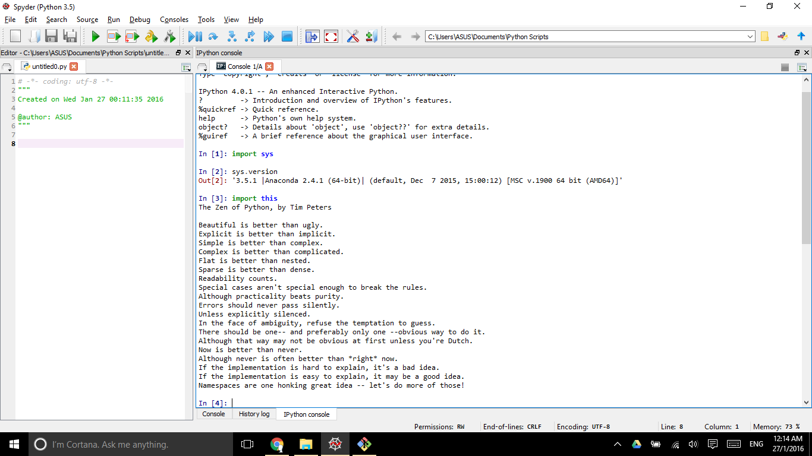

UECM3033 Assignment #1 Report
========================================================

- Prepared by: ** Jesslyn Kho Hui Yee **
- Tutorial Group: T2

--------------------------------------------------------

## Task 1 -- setup a github repository

The reports, codes and supporting documents are uploaded to Github at: 

[https://github.com/jesslynk/UECM3033_assign1](https://github.com/jesslynk/UECM3033_assign1)

---------------------------------------------------------

## Task 2 -- setup python

Put here the screen shot of file (python.png)

------------------------------------------------------------

## Task 3 -- modify and run Python script

In this section, please report:

1. The hexadecimal value of your student ID.
Hexadecimal representation of 1304565 is 0x13e7f5

2. Write down the definite integrals that you have chosen.

$$\int_0^{\infty} \sqrt{x}e^{-x} dx = \frac{\sqrt{\pi}}{2}.$$

3. Write down your system of 10 linear equations.

\begin{align*}
3x_0 + 2x_1 + 3x_2 + x_3 + 5x_4 + 2x_5 + 2x_6 + 6x_7 + 7x_8 + 8x_9 &= 9,\\
X_0 + 2x_1 + 4x_2 + 4x_3 + 6x_4 + 4x_5 + 9x_6 + 3x_7 + 6x_8 + 8x_9 &= 8,\\
6X_0 + 7x_1 + 9x_2 + 4x_3 + 5x_4 + 3x_5 + 2x_6 + x_7 + 4x_8 + 5x_9 &= 3,\\
5X_0 + 8x_1 + 5x_2 + 9x_3 + 4x_4 + 5x_5 + 2x_6 + 7x_7 + 2x_8 + 6x_9 &= 5,\\
X_0 + 2x_1 + 6x_2 + 6x_3 + 3x_4 + 6x_5 + 2x_6 + 8x_7 + 7x_8 + 6x_9 &= 1,\\
X_0 + 3x_1 + 5x_2 + 7x_3 + 6x_4 + 7x_5 + 2x_6 + 8x_7 + 9x_8 + 6x_9 &= 7,\\
X_0 + 2x_1 + 4x_2 + 4x_3 + 6x_4 + 4x_5 + 9x_6 + 3x_7 + 6x_8 + 8x_9 &= 8,\\
4X_0 + 5x_1 + 5x_2 + 8x_3 + 9x_4 + 7x_5 + 2x_6 + x_7 + x_8 + 6x_9 &= 9,\\
9X_0 + 2x_1 + 8x_2 + 2x_3 + 8x_4 + 3x_5 + 4x_6 + 6x_7 + 5x_8 + 9x_9 &= 2,\\
4X_0 + 4x_1 + 2x_2 + 7x_3 + 8x_4 + 7x_5 + 9x_6 + x_7 + 2x_8 + 3x_9 &= 6.
\end{align*}

Here are the examples of how to add equations in markdown:

$$\int_0^{\infty} e^{-x^2} dx = \frac{\sqrt{\pi}}{2}.$$

\begin{align*}
3 x_0 +x_1 &= 9,\\
x_0 + 2 x_1 &= 8.
\end{align*}

-----------------------------------

last modified: 27/1/16
